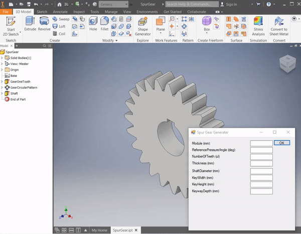

# MechToolbox
Generate CAD models of mechanical parts using Inventor SDK

Sample from v0.9

## How to use:
- clone the repo
- the latest app release is in Source/Builds
- run the app, click "Get File" to select a part from PartsLibrary
- after Inventor initializes, form will populate with parameters
- customize your parameters, and parameters are automatically saved on each change

## Contribute:
Contribute a model to PartsLibrary
- the app searches for and changes UserParameter of the model, so make sure your dimensions are linked to them
- there must be 1 UserParameter called "type" that has text as its input field, that is the name of the model
- right now the app supports a maximum of 12 UserParameter (not incl. name) 

## App TODO:
- not update if blank, instead of throwing textbox
- read/write FileStream of ipt instead of opening Inventor instance
- complete Inventor units

## CAD TODO:
- make bevel gear
- make other models

## Q&A:
- Q: Why a separate app and not as an add-in?
- A: 
First is for extendability. For example, C# has lots of libraries for parsing different data formats, so if one ever becomes popular, or if I need to make models from a niche data format, it’s very easy to just add it into the app, rather than waiting for next year’s Inventor version. This also true for extending in other ways, like I could make the app compatible with both Inventor and Solidworks, etc etc.
Second is this app works with any Inventor part as long as the dimensions are formatted accordingly. Means that someone without Inventor experience can get a useful part without going through tutorials on Inventor UI (or maybe without even having Inventor installed, if I can get the SDK to do the things I want). Abstraction can be useful.

- Q: Why Inventor (for now)?
- A: 
Inventor API is available with every install of Inventor (I believe) and very easy to install. Inventor itself is free to hobbyists and students, which means that anyone can contribute to the project. Compared to SolidWorks, you need a paid serial number to get the SDK, so students and hobbyists have to individually request it. I'm in the process of requesting one right now. Even then, SolidWorks might not approve or ignore my request and I just can't do it. Dassault Systems, if you see this, please give it to me. Thanks.

## Releases:
v0.4
- integration of Solidworks
- every instance of app creates an instance of Solidworks/Inventor, so each instance can work independently
- left polling inside InventorModelWrapper alone, it's only used once so it's fine if it's not refactored into an async method

v0.3
- instead of manually opening part instance and modifying current part, app takes part path, copies part, open part, save on parameter modification
- Inventor window can be ignored completely while using app (still need Inventor instance opened per Inventor SDK's implementation)

v0.2
- supports all options of length, angle, and unitless found in inventor
- can't change unit in app
- supports 12 user parameters max

v0.1
- supports 3 units max (cm, mm, in), supports 4 user parameters max
- only has test model in PartsLibrary folder
- fully generalized for any model with matched user parameters formatting